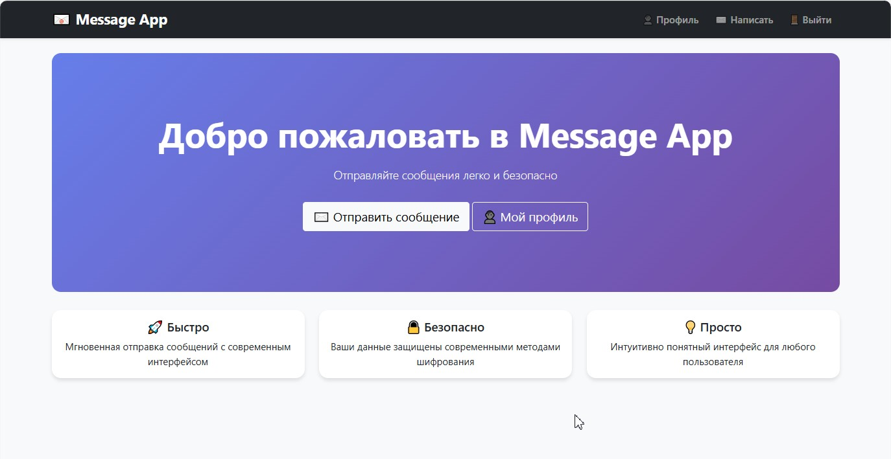
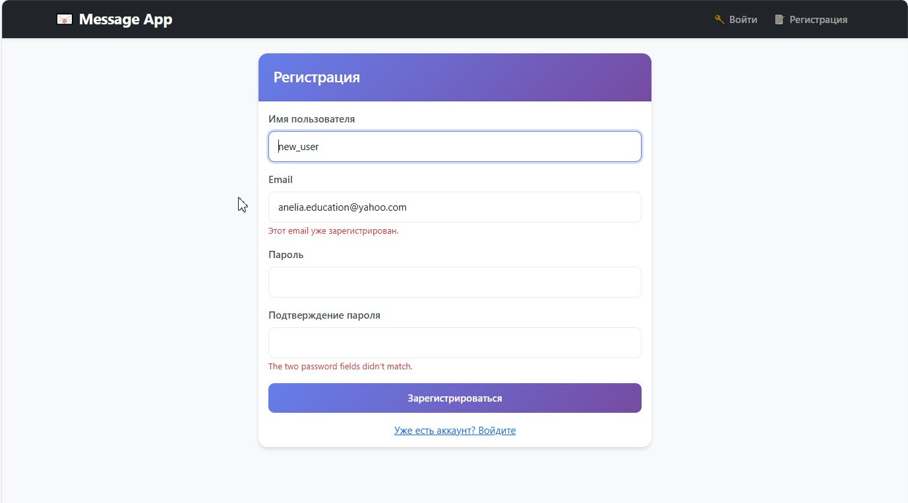
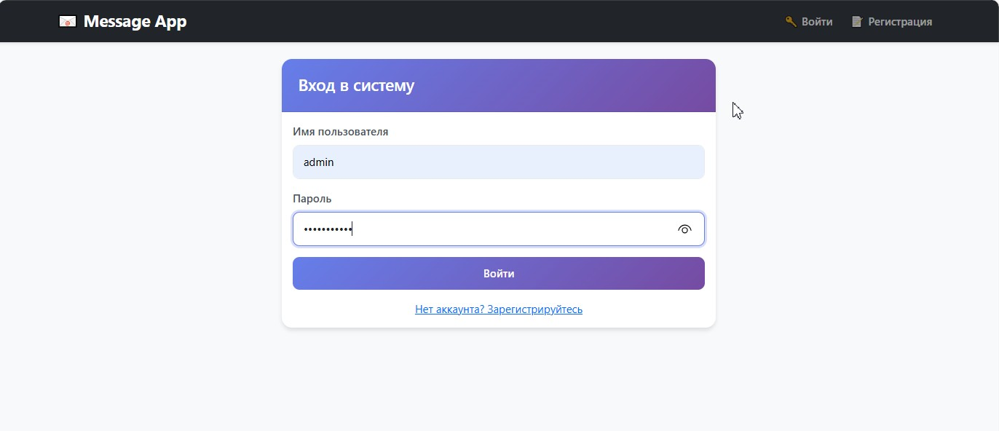
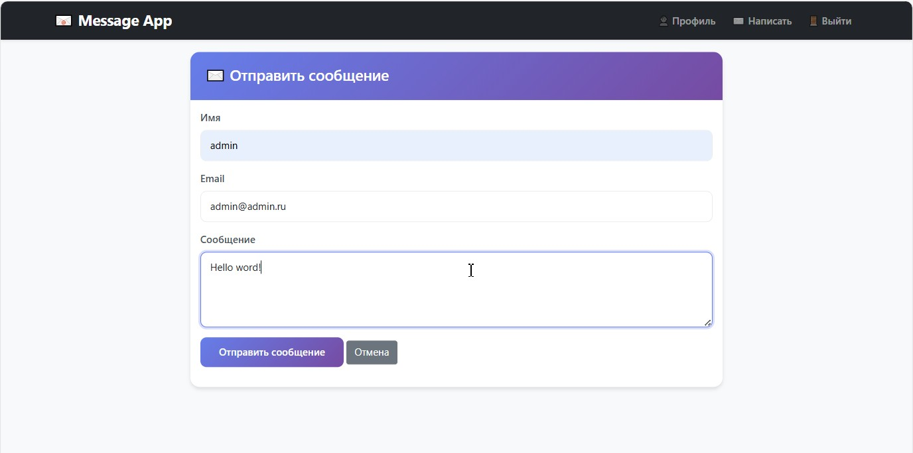
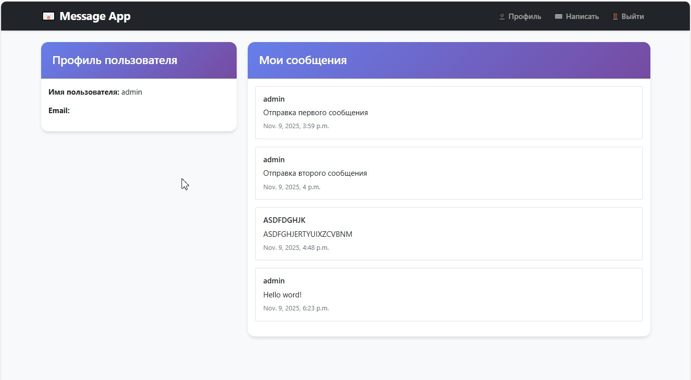

# 🚀 Django Multi-Functional Forms Application

<div align="center">


**Веб-приложение с системой регистрации, авторизации и отправки сообщений**

[Описание](#описание) • [Функциональность](#функциональность) • [Установка](#установка) • [Использование](#использование) • [Структура](#структура-проекта)

</div>

## 📋 Описание

Проект представляет собой полнофункциональное веб-приложение на Django с системой пользователей и отправки сообщений. Приложение включает регистрацию, авторизацию, валидацию форм и AJAX-отправку данных.

## 🖼️ Демонстрация

### 📱 Главная страница

*Главная страница с навигацией*

### 👤 Регистрация

*Форма регистрации с валидацией*

### 🔐 Вход в систему

*Страница авторизации*

### ✉️ Отправка сообщения

*AJAX форма отправки сообщений*

### 📊 Профиль пользователя

*Профиль с историей сообщений*

## ✨ Функциональность

### 🔐 Система пользователей
- ✅ **Регистрация** с кастомной валидацией
- ✅ **Авторизация** с перенаправлением
- ✅ **Кастомная модель пользователя** с дополнительными полями
- ✅ **Защита маршрутов** с `@login_required`

### 💬 Система сообщений
- ✅ **Отправка сообщений** с AJAX поддержкой
- ✅ **Валидация** длины и содержания сообщений
- ✅ **История сообщений** в профиле пользователя
- ✅ **Мгновенные уведомления** об успешной отправке

### 🎨 Интерфейс
- ✅ **Адаптивный дизайн** с Bootstrap 5
- ✅ **Русская локализация** всех форм
- ✅ **Интуитивный UX** с сообщениями об ошибках
- ✅ **Без перезагрузки** при отправке сообщений

## 🛠 Технологии

<div align="center">

| Технология | Назначение | Версия |
|------------|------------|---------|
|  | Основной язык | 3.8+ |
|  | Веб-фреймворк | 4.2+ |
|  | Стилизация | 5.3+ |
|  | База данных | 3.35+ |
|  | AJAX запросы | ES6+ |

</div>

## ⚡ Быстрый старт

### Предварительные требования
- Python 3.8 или выше
- pip (менеджер пакетов Python)

### Установка и запуск

1. **Клонирование репозитория**
```bash
git clone https://github.com/your-username/django-forms-app.git
cd django-forms-app
```
2. **Создание виртуального окружения**
```
python -m venv venv
source venv/bin/activate  # Linux/MacOS
venv\Scripts\activate     # Windows
```
3. **Установка зависимостей**
```
bash
pip install -r requirements.txt
```
4. **Настройка базы данных**
```
bash
python manage.py makemigrations
python manage.py migrate
```
5. **Создание суперпользователя**
```
bash
python manage.py createsuperuser
```
6. **Запуск сервера**
```
bash
python manage.py runserver
```
7. **Открытие в браузере**
```
http://127.0.0.1:8000/
```
## 📁 Структура проекта
```
message_app/
├── accounts/                 # Приложение пользователей
│   ├── __init__.py
│   ├── admin.py             # Админ-панель для пользователей
│   ├── apps.py              # Конфигурация приложения
│   ├── models.py            # Кастомная модель User
│   ├── forms.py             # Формы регистрации и авторизации
│   ├── views.py             # Обработчики пользователей
│   ├── urls.py              # Маршруты пользователей
│   └── migrations/          # Миграции базы данных
│       ├── __init__.py
│       └── ...              # Файлы миграций
├── message_app/              # Главное приложение (проект)
│   ├── __init__.py
│   ├── settings.py          # Настройки Django
    ├── admin.py             # Админ-панель 
│   ├── urls.py              # Главные URL маршруты
│   ├── wsgi.py              # WSGI конфигурация
│   └── asgi.py              # ASGI конфигурация
├── messages_app/            # Приложение сообщений
│   ├── __init__.py
│   ├── admin.py             # Админ-панель для сообщений
│   ├── apps.py              # Конфигурация приложения
│   ├── models.py            # Модель Message и связанные
│   ├── forms.py             # Форма отправки сообщений
│   ├── views.py             # Обработчики сообщений
│   ├── urls.py              # Маршруты сообщений
│   └── migrations/          # Миграции базы данных
│       ├── __init__.py
│       └── ...              # Файлы миграций
├── templates/               # HTML шаблоны
│   ├── base.html           # ⭐ Базовый шаблон 
│   ├── accounts/           # Шаблоны пользователей
│   │   ├── register.html   # Страница регистрации
│   │   ├── login.html      # Страница авторизации
│   │   ├── profile.html    # Профиль пользователя
│   │   └── registration_success.html
│   └── messages_app/       # Шаблоны сообщений
│       ├── home.html       # Главная страница
│       ├── send_message.html # Отправка сообщений
├── static/                 # Статические файлы
│   ├── css/               # Стили CSS
│   │   ├── style.css      # Основные стили
│   ├── js/                # JavaScript файлы
│   │   ├── main.js        # Основные скрипты
│   └── images/            # Изображения и иконки
│       └── favicon.ico
├── screenshots/           # 
│   ├── home.png
│   ├── register.png
│   ├── login.png
│   ├── send-message.png
│   └── profile.png
├── requirements.txt       # Зависимости проекта
├── manage.py             # Управление Django
└── README.md             # Документация проекта
```
## 🎯 Использование

### Для пользователей:
- **Регистрация** - Создайте аккаунт с email и паролем
- **Авторизация** - Войдите в систему
- **Отправка сообщений** - Используйте форму с AJAX поддержкой
- **Просмотр истории** - Смотрите свои сообщения в профиле

### Для разработчиков:
- **Модульная структура** для легкого расширения
- **Готовые формы с валидацией** для повторного использования
- **AJAX примеры** для современных веб-приложений

## 🔧 API Endpoints
```
Метод	URL	Назначение
GET	/register/	Страница регистрации
POST	/register/	Создание пользователя
GET	/login/	Страница авторизации
POST	/login/	Аутентификация
GET	/profile/	Профиль пользователя
GET	/send-message/	Форма отправки сообщения
POST	/send-message/	AJAX отправка сообщения
```
## 📊 База данных
### Модели:
- **CustomUser** - Пользователи (расширенная модель)
- **Message** - Сообщения пользователей
- **MessageResponse** - Ответы на сообщения (опционально)
- **Notification** - Уведомления пользователей

## 🚀 Развертывание
### Для продакшн окружения:
1. Настройте PostgreSQL вместо SQLite
2. Установите DEBUG = False
3. Настройте статические файлы через collectstatic
4. Используйте WSGI сервер (Gunicorn + Nginx)

## 🤝 Вклад в проект
Мы приветствуем вклад в развитие проекта!
1. **Форкните репозиторий**
2. **Создайте feature ветку**  
   `git checkout -b feature/AmazingFeature`
3. **Закоммитьте изменения**  
   `git commit -m 'Add some AmazingFeature'`
4. **Запушьте ветку**  
   `git push origin feature/AmazingFeature`
5. **Откройте Pull Request**

## 📄 Лицензия
Этот проект распространяется под лицензией MIT. Смотрите файл LICENSE для подробностей.

## 👨‍💻 Автор
GitHub:(https://github.com/BizziBerry)

## 🙏 Благодарности
- Команда Django за отличный фреймворк
- Сообщество Bootstrap за готовые компоненты

## ⭐ Не забудьте поставить звезду репозиторию!
